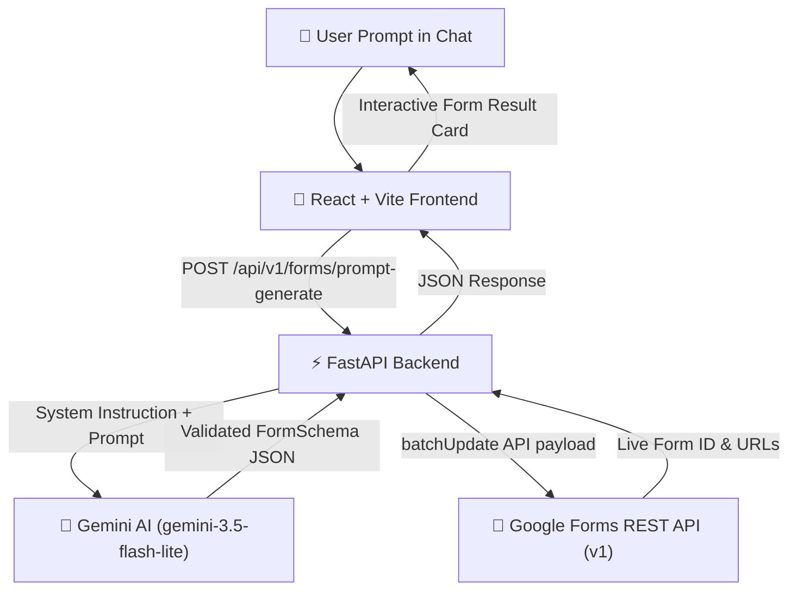

# ⚡ Prompt2Form — AI-Powered Google Form Generator & Editor

[](https://prompt-2-form.vercel.app)


> Transform natural language prompts into live, fully populated Google Forms in seconds — with real-time conversational AI updates!

---

## 🌟 Key Features

- 🤖 **Instant AI Form Generation:** Describe any form in plain English (e.g. *"Create a registration form for SPACE Event with name, email, phone, branch, year, and T-shirt size"*) and watch AI construct the full schema.
- 💬 **Conversational Live Editing:** Update existing forms naturally (e.g. *"delete the T-shirt field"* or *"add a college field"*) — the agent updates the live Google Form in-place without generating duplicates!
- 🔐 **Google Workspace OAuth:** Direct OAuth 2.0 authentication with `forms.body` scope to create and manage forms inside the user's personal/organization Google account.
- ⚡ **Atomic `batchUpdate` Execution:** Populates form metadata, descriptions, single choice, checkboxes, dropdowns, dates, scale questions, and required validation rules in a single API call.
- 🎨 **Modern Dark UI:** Built with React 19, Tailwind CSS, Lucide icons, and responsive glassmorphism design.

---

## 🏗️ Architecture Flow



---

## 🛠️ Tech Stack

### **Frontend**
- **Framework:** React 19 + TypeScript + Vite
- **Styling:** Tailwind CSS + Radix UI Primitives + Lucide Icons
- **HTTP Client:** Axios (centralized interceptors + 90s timeout handling)
- **Routing:** React Router v7

### **Backend**
- **Framework:** FastAPI (Python 3.11+)
- **AI Engine:** Google Generative AI SDK (`google-genai`)
- **OAuth & Auth:** PyJWT + Google OAuth 2.0
- **HTTP Client:** `httpx` (Async HTTP engine)

---

## 🚀 Local Development Setup

### 1. Prerequisites
- Python 3.11+
- Node.js 18+
- Google Cloud Console Project with **Google Forms API** enabled
- Gemini API Key from [Google AI Studio](https://aistudio.google.com/)

### 2. Backend Setup
```bash
cd backend
python -m venv venv
# Windows
.\venv\Scripts\activate
# Linux/macOS
source venv/bin/activate

pip install -r requirements.txt
cp .env.example .env
```

Fill in your `.env` values:
```env
GEMINI_API_KEY=your-gemini-api-key
LLM_PROVIDER=gemini
GEMINI_MODEL=gemini-3.5-flash-lite
GOOGLE_CLIENT_ID=your-google-client-id
GOOGLE_CLIENT_SECRET=your-google-client-secret
GOOGLE_REDIRECT_URI=http://localhost:8000/api/v1/auth/callback
FRONTEND_URL=http://localhost:3000
SECRET_KEY=dev-secret-key-123
SESSION_SECRET=dev-session-secret-123
```

Start the FastAPI backend:
```bash
python -m uvicorn app.main:app --host 127.0.0.1 --port 8000 --reload
```

### 3. Frontend Setup
```bash
cd frontend
npm install
npm run dev
```

Open **[http://localhost:3000](http://localhost:3000)** in your browser!

---

## 📄 License

This project is licensed under the MIT License - see the [LICENSE](LICENSE) file for details.
